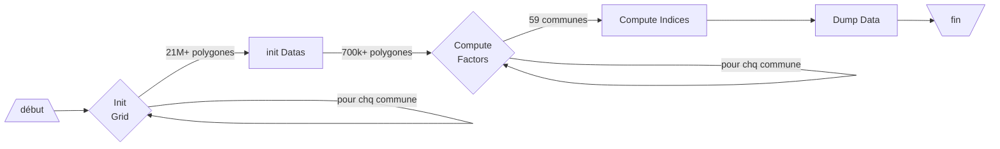
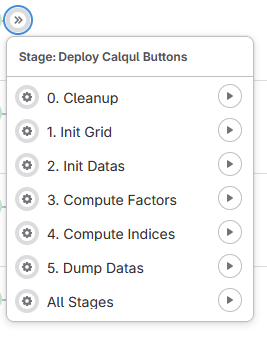

# Script de recalcul du calque de plantabilité

- [Documentation générale du projet](https://forge.grandlyon.com/systemes-dinformation/arb_calque_plantabilite/)
- [Documentation d'installation de ce code](https://forge.grandlyon.com/systemes-dinformation/script-recalcul-calque/)

## Intégration continue & Déploiement

L'intégration continue et le déploiement continue fonctionne de façon semi-automatique à partir de la plateforme Gitlab (Forge). 
La phase de build est réalisée automatiquement dans la Gitlab à chaque commit sur la branche.
La seule branche qui n'est pas buildée est mla branche protégée : __main__.

Ce dépôt est structuré en 4 branches.

- __Main__ : La dernière version stable du code. **Cette branche n'est jamais ni buildée nu déployée, Il s'agit de la branche de référence et elle est protégée**.
             Les mises à jour y sont contrôlées et effectuées à chaque nouvelle version fonctionnlle, testée et stable du code. 
- __develop__ : Branche développement pour les nouvelles fonctionnalités. **Cette branche est buildée et déployée sur le namespace de développement ns-arb-d01**.
- __rec__ : Branche d'intégration et de recette des nouvelles fonctionnalités. **Cette branche est buildée et déployée sur le namespace de recette ns-arb-r01**.
- __pro__ : Branche de production de l'application. **Cette branche est buildée et déployée sur le namespace de production ns-arb-p01**.
            Le build et le déploiement de cette branche est manuel.

## Build

### Configuration de Gitlab
Sous la rubrique Settings > CI/CD > Variables, chaque variable ci-dessous doit être initialisée pour chaque environnement :

#### DB_PARAMS
- Type : File

- Valeur :

```bash
export POSTGRES_DB=calque_planta_temp
export POSTGRES_PASSWORD=xxxxx
export POSTGRES_PORT=5432
export POSTGRES_SERVER=calqul-db-service
export POSTGRES_USER=calqul
export POSTGRES_SCHEMA=base
export POSTGRES_EXTERNAL_PORT=300xx
export POSTGRES_PVC_NAME=Nom du PVC de base se données (type ceph-rbd)
export FILESYSTEM_PVC_NAME=Nom du PVC filesystem (type Cephfs)
```

#### DEPLOY_RUNNER

-  Type : Variable

- Valeur : ns-arb-x01

#### KUBECONFIG

- Type : File

- Valeur : (catte valeur est récuépérée à partir du manager Openshift)

```yaml  
 apiVersion: v1
 clusters:
   - cluster:
       certificate-authority-data: 
       ...=
       server: 'https://api.air.grandlyon.fr:6443'
     name: 'cluster-interne-pro'
 contexts:
      ....
```

#### NAMESPACE_ENV

-  Type : Variable

- Valeur : [d,r,p]01

## Deploy 

### Déploiement d'un Job Openshift
Le déploiement s'appuie sur un job OpenShift plutôt qu'un Pod. 
L'intérêt réside dans le fait qu'un job se lance, fait ce qu'il a à faire et s'arrête lorsqu'il a fini, avec un code de sortie 0 ou 1.
Il consomme les ressources nécessaires le temps de l'exécution de son script, puis s'arrête, contrairement au pod qui reste en attente une fois déployé et qui est relancé s'il tombe.

Doc : 
 - https://cloud.redhat.com/blog/openshift-jobs
 - https://docs.openshift.com/container-platform/4.11/nodes/jobs/nodes-nodes-jobs.html

#### Installation d'un nouvel environnement

1. Créer un nouveau namespace openShift
   1. Créer les PVC sur le molèdes des PVC existants danss l'environnement de dev.
      - pvc-xx-ns-arb-[ENV]-claim : 40Go - ceph-rbd
      - pvc-xx-ns-arb-[ENV]-claim : 20Go -  cephfs
   2. Créer un Runner (cf https://guide.air.grandlyon.fr)
   3. Récupérer le KUBECONFIG
2. Duppliquer toutes les variables Gitlab liées à un environnement
3. Créer le token d'accès au __dépôt des données cartographiques__
   Sous la console OpenShift, menu 'Secrets' copier le Yaml du secret `arb-data-access-token` et le créer dans le nouveau namspace.

#### Suppression d'un job

 - https://access.redhat.com/documentation/en-us/openshift_container_platform/3.4/html/developer_guide/dev-guide-scheduled-jobs

#### Commandes lancées par le job 

Le job déroule calcul en 6 étapes, avec un étape de mise à blanc complet de l'environnement (0), et une étape de dump du résultat (5).
Après l'étape 1, toutes les autres étapes peuvent être relancées à n'importer quel moment tant qu'on execute tout jusqu'à la fin.
exemple : si vous relancez 3, faîtes 3,4,5

`cleanup|init-grid|init-datas|compute-factors|compute-indices|dump-datas|all`

0. cleanup => Nettoie les tables de progression, nettoie le cache des tuiles, avant un recalcul complet.
1. init-grid => Initialise la base de données avec chaque tuile sur tout le territoire.
2. init-datas => Initialise toutes les données avec chaque facteur.
3. compute-factors => Calcule tous les facteurs.
4. compute-indices => Calcule les indices de chaque tuile.
5. dump-datas => Effectue une sauvegarde de la base de données.
. all => Lance toutes les étapes dans l'ordre décrit ci-dessous.

   - main.py cleanup
   - main.py initGrid
   - main.py initDatas
   - main.py computeFactors
   - main.py computeIndices
  


#### Relancer un Job

 1. Se connecter à OpenShift
 2. Supprimer le pod correspondant à l'étape du Job. 
 
 >   __Par exemple__, pour l'étape `computeFactor`, le nom du job dans OpenShift est `calqul-stage-compute-factors-r01`, 
 >   et le nom du pod associé à ce job est de la forme `calqul-stage-compute-factors-r01-xxxxx`

 3. Dans la pipeline du projet, relancer l'étape via l'interface web 

